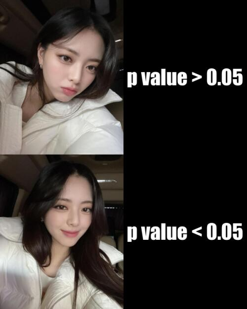

# Welcome to my Stats Repo

## About me
I am in my final year of data science at the [University of Auckland](https://www.auckland.ac.nz/en.html). **I like to chill with friends and like dogs.**


## Meme I created

* This is a meme I created it is an adaptation of the famous Drake hot line bling meme. 
  * 

* It is replaced with another celebrity called ***Yuna Shin*** from the music group ***Itzy***.



## My `R` code

```R
library(magick)

straight_face = image_read("https://images-ext-1.discordapp.net/external/OlX3482g87oO2FXrZuU_3oLd0vPooAyHfZ2zJJE8rOQ/https/pbs.twimg.com/media/FNESVagVkAEq5ay.jpg%3Aorig?width=541&height=676") %>%
  image_scale(300)


smile = image_read("https://images-ext-2.discordapp.net/external/u7UFxPMrxXqhFJzHAVWe4TX3ScODV1IDmXVB94wqNlM/https/pbs.twimg.com/media/FNESWlMVkAMtCtf.jpg%3Aorig?width=541&height=676") %>%
  image_scale(300)


image_append(face_vector, stack = TRUE)


greater_text = image_blank(width = 300, 
                        height = 375, 
                        color = "#000000") %>%
  image_annotate(text = "p value > 0.05",
                 color = "#FFFFFF",
                 size = 50,
                 font = "Impact",
                 gravity = "center")


less_text = image_blank(width = 300, 
                        height = 375, 
                        color = "#000000") %>%
  image_annotate(text = "p value < 0.05",
                 color = "#FFFFFF",
                 size = 50,
                 font = "Impact",
                 gravity = "center")

top_vector = c(straight_face, greater_text)

bot_vector = c(smile, less_text)

top_row = image_append(top_vector)

bot_row = image_append(bot_vector)

new = c(top_row, bot_row)

meme = image_append(new, stack = TRUE) %>%
  image_scale(500)


image_write(meme, "my_meme.png")


```
